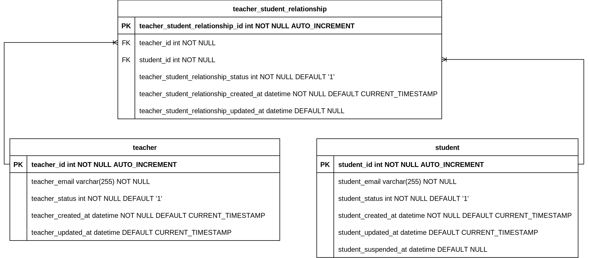

# Ufinity Interview Assignment

This is the codebase for the Ufinity interview test assignment.

## Prerequisites

- NodeJS v18.x.x
- Docker

## Folder Structure

| S/N | Name      | Type | Description                                                                                                               |
| --- | --------- | ---- | ------------------------------------------------------------------------------------------------------------------------- |
| 1   | database  | dir  | Contains the DDL query for the database                                                                                   |
| 2   | src       | dir  | Contains the config, models, routes, controllers, services, utils, rules, test, errors, middleware, and const directories |
| 3   | README.md | file | This file                                                                                                                 |

## Exposed Ports

| S/N | Application                         | Exposed Port |
| --- | ----------------------------------- | ------------ |
| 1   | database (Development Environment)  | 33306        |
| 1   | database (Test Environment)         | 33306        |
| 2   | application                         | 3000         |

## Commands

All the commands listed below should be run in the `./ufinity_interview_assignment` directory.

### Installing Dependencies

```bash
npm install
```

### Starting the Project

Start the project in the local environment, which also starts the necessary dependencies such as the database.

```bash
npm start
```

### Running in Watch Mode

Start the application in watch mode.

```bash
npm run start:dev
```

### Execute Automated Tests

To execute the automated tests.

```bash
npm test
```

### Clear Test Database

To remove the existing test database container service.

```bash
npm run test:clear
```

### Execute ESLint

To execute ESLint and check your code for any potential issues or errors.

```bash
npm run lint
```

### Execute prettier

To execute Prettier and format your code according to the specified rules.

```bash
npm run prettier
```

## Steps to Run a Local Instance

1. Clone the project repository from this URL: https://github.com/CkKean/ufinity_interview_assignment.git
2. Open the codebase in your preferred IDE (e.g., VS Code)
3. Start Docker Desktop to run the MySQL database
4. Run `npm install` to install the project dependencies
5. Run `npm start` to start the project. The application is ready for use if display following message. Please check FAQ if there are any issues.

```
 ✔ Container teacher-administration-system-mysql  Running                                                                                                                                                                                                         0.0s 

> teacher-administration-system@1.0.0 start
> ts-node ./src/server.ts

2023-07-05 15:50:40     [database.ts]   INFO    Executing (default): SELECT 1+1 AS result
2023-07-05 15:50:40     [server.ts]     INFO    Application started at http://localhost:3000
```

6. You should be able to send a GET request to the following endpoint and receive a 200 response:

```
http://localhost:3000/api/healthCheck/
```

## Testing

The test suites are located in the `ufinity_interview_assignment/src/test` directory. There is one test suite with 31 test cases for the Student APIs. A default set of dummy data will be created before executing the test script. The data will remain for every test run for consistency. Please check FAQ if has any issues on executions.

### Steps to Run the Tests

1. Start Docker Desktop to run the MySQL database.
2. Run `npm test` to run the tests. The test result will be displayed if there are no problems on init database container. Please check FAQ if there are any issues.
```
Test Suites: 1 passed, 1 total
Tests:       31 passed, 31 total
Snapshots:   0 total
Time:        8.037 s, estimated 31 s
```
3. Run `npm run test:clear` to remove the existing test database.
Note: It is better to run step 3 to clear the existing database to make consistent data.

## API Routes

The following APIs are available for the test assignment:

### 1. **POST** `http://localhost:3000/api/register`

- Register one or more students to a specified teacher. The API behaves differently based on the conditions below:
     - a. If the student exists but is unassigned, they will be assigned to the specified teacher.
     - b. If the student does not exist, a new student record will be created and assigned to the specified teacher.
     - c. If the student exists and is already assigned, no action will be taken.
 - Request:
    - Method: POST
    - URL: /api/retrievefornotifications
    - Headers:
      - Content-Type: application/json
    - Request Body:
      ```json
      {
        "teacher": "teacherken@gmail.com",
        "notification": "Hello students! @studentagnes@gmail.com @studentmiche@gmail.com"
      }
- Response:
   - Status: 204 No Content

### 2. **GET** `http://localhost:3000/api/commonstudents?teacher=teacherken@gmail.com`

- Retrieve a list of students who are common to a given list of teachers.
- Request:
   - Method: GET
   - URL: /api/commonstudents
   - Request example: `/api/commonstudents?teacher=teacherken@gmail.com`
   - Headers:
     - Content-Type: application/json
- Response:
   - Status: 200 OK
   - Response Body:
      ```json
        {
          "students": [
            "commonstudent2@gmail.com",
            "commonstudent3@gmail.com",
            "commonstudent1@gmail.com",
            "commonstudent5@gmail.com"
          ]
        }

### 3. **POST** `http://localhost:3000/api/suspend`

- Suspend a specified student.
- Request: 
    - Method: POST
    - URL: /api/suspend
    - Headers:
      - Content-Type: application/json
    - Request Body:
      ```json
      {
        "student": "commonstudent4@gmail.com"
      }
- Response:
  - Status: 204 No Content


### 4. **POST** `http://localhost:3000/api/retrievefornotifications`

- Retrieve a list of students that can receive a given notification by specific teacher. The list of students retrieved should not contain any duplicates/repetitions.
- Request:
    - Method: POST
    - URL: /api/retrievefornotifications
    - Headers:
      - Content-Type: application/json
    - Example 1:
      - Request Body:
        ```json
        {
          "teacher": "teacherken@gmail.com",
          "notification": "Hello students!"
        }
      - Response:
          Status: 200 OK
          Body:
          ```json
          {
            "students": [
              "commonstudent1@gmail.com",
              "commonstudent2@gmail.com",
              "commonstudent5@gmail.com",
            ]
          }
    - Example 2:
      - Request Body:
        ```json
        {
          "teacher": "teacherken@gmail.com",
          "notification": "Hello students! @studentagnes@gmail.com @studentmiche@gmail.com"
        }
      - Response:
          Status: 200 OK
          Body:
          ```json
          {
            "students": [
              "commonstudent1@gmail.com",
              "commonstudent2@gmail.com",
              "commonstudent5@gmail.com",
              "studentagnes@gmail.com", 
              "studentmiche@gmail.com",
            ]
          }

### 5. **POST** `http://localhost:3000/api/teachers`

- Create a new teacher record.
- Request  
   - Method: POST
   - URL: /api/teachers
   - Headers:
     - Content-Type: application/json
   - Request Body:
        ```json
        {
          "teacher_email": "teacherck@gmail.com"
        }
- Response:
  - Status: 200 OK

### 6. **GET** `http://localhost:3000/api/healthCheck/`

- This endpoint is used to check if the system is running or not.
- Request  
  - Method: GET
  - URL: /api/healthCheck
  - Headers:
    - Content-Type: application/json
- Response:
  - Status: 200 OK
  - Response Body: OK

## Database
The application uses a MySQL database to store data. The database schema is automatically created when the MySQL Docker container is initialized for the first time.

The database has three tables as ERD shows:

1. student: Stores student information
2. teacher: Stores teacher information
3. teacher_student_relationship: Stores the relationship between students and teachers

### ERD


## Environments
There are two environments in which the application operates: test and development.

### Test Environment
  - The test environment is used for running automated tests. It has a separate MySQL database for testing purposes. The test database configuration can be customized in the .env file and add it into the /src directory. The default test database configuration is as follows:
  
    - Host: 127.0.0.1
    - Port: 33307
    - Schema: teacher-administration-system-test

### Development Environment 
  - The development environment is used for local development and testing. It has its own MySQL database. The development database configuration can be customized in the .env file and add it into the /src directory. The default test database configuration is as follows:

    - Host: 127.0.0.1
    - Port: 33306
    - Schema: teacher-administration-system

## Test Data

The following is the default sample data used for Student APIs:

- Students:
  - commonstudent1@gmail.com
  - commonstudent2@gmail.com
  - commonstudent3@gmail.com
  - commonstudent4@gmail.com
  - commonstudent5@gmail.com (Suspended)

- Teachers:
  - teacherken@gmail.com
  - teacherjoe@gmail.com
  - teacherkang@gmail.com
  - teacherping@gmail.com

- Teacher-Student Relationships:
  - teacherken@gmail.com - commonstudent1@gmail.com
  - teacherken@gmail.com - commonstudent2@gmail.com
  - teacherken@gmail.com - commonstudent5@gmail.com
  - teacherjoe@gmail.com - commonstudent2@gmail.com
  - teacherjoe@gmail.com - commonstudent3@gmail.com

Note: The student with email "commonstudent5@gmail.com" is suspended and will not receive notifications.

<br>

## FAQ

### Error when starting up

If you encounter the following error when running `npm start`, it is due to the slow startup of your database container.<br>
Please run `npm start` again.

```

[server.js] ERROR SequelizeConnectionError: Connection lost: The server closed the connection.
[server.js] ERROR Unable to start application

```

### Error when conducted testing

If you encounter the following error when running `npm test`, it is due to the slow startup of your database container.<br>
Please run `npm test` again. It might display partial test cases passed result if the following error occurs.

```
[server.js] ERROR SequelizeConnectionError: Connection lost: The server closed the connection.
[server.js] ERROR Unable to start application

```
